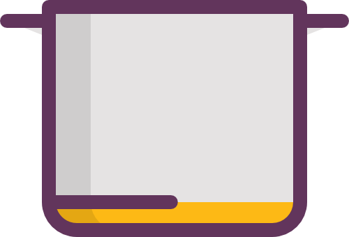
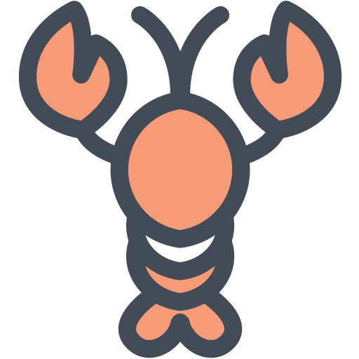

https://freevue-soup.netlify.com/

# History

### 2019.01.19
* `저장소 생성`

javascript 상태 
```javascript
window.onload = function(){
  var i = 1;
  var $food;
  
  setInterval(function(){
    var k = Math.floor(Math.random() * 11);
    
    i++;
    
    if(k === 0 || k == 4 || k == 8){
      $food = $('.food1');
    }else if(k == 1 || k == 5 || k == 9){
      $food = $('.food2');
    }else if(k == 2 || k == 6 || k == 10){
      $food = $('.food3');
    }else if(k == 3 || k == 7 || k == 11){
      $food = $('.food4');
    }
    
    $food.css({'bottom' : '230px'});
    
    $('.head').css({'top' : '-250px', 'transform' : 'rotate(' + (360 * i) + 'deg)'});
    
    setTimeout(function(){
      $('.head').css({'top' : '0'});
      $food.css({'bottom' : '3px'});
    }, 1000);
  }, 2500);
  
  $('.firebox .fire2').css({'transform' : 'rotateY(180deg)'});
  
  setInterval(function(){
    $('.firebox .fire1').css({'transform' : 'rotateY(180deg)'});
    $('.firebox .fire2').css({'transform' : 'rotateY(0deg)'});
    $('.firebox .fire3').css({'transform' : 'rotateY(180deg)'});
    
    setTimeout(function(){
      $('.firebox .fire1').css({'transform' : 'rotateY(0deg)'});
      $('.firebox .fire2').css({'transform' : 'rotateY(180deg)'});
      $('.firebox .fire3').css({'transform' : 'rotateY(0deg)'});
    }, 150);
  }, 300);
}
```
css 상태
```css
* {margin:0; padding:0;}
ul,ol {list-style:none;}
img {border:0; display:block; width:100%;}
a {text-decoration:none; color:#000;}

html,body {height:100%; overflow:hidden;}

.table {display:table; width:100%; height:100%; text-align:center;}
.table .cell {display:table-cell; vertical-align:middle;}
.table .cell .box {width:35%; margin:0 auto; position:relative; padding-top:150px;}
.table .cell .box .head {position:relative; transform-origin:center; transition:all 0.5s; top:0; z-index:90;}
.table .cell .box .body {margin-top:10px; z-index:80; position:relative;}
.table .cell .box .food {position:absolute; width:60%; bottom:3px; transition:all 0.5s; left:50%; margin-left:-10.5vw;}
.table .cell .firebox {overflow:hidden; width:20%; margin:0 auto; --box-shadow:0 3px #000;}
.table .cell .firebox img {float:left; width:29%; margin:0 2%;}
```
html 상태
```html
<div class="table">
  <div class="cell">
    <div class="box">
      
      
      
      
      
      
    </div>
    <div class="firebox">
      
      
      
    </div>
  </div>
</div>
```
