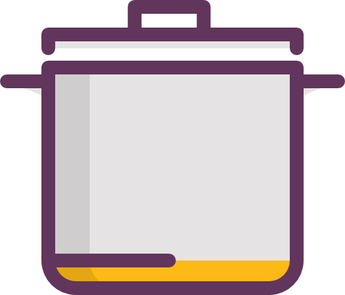
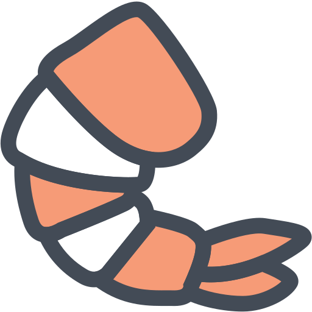

https://freevue-rotate.netlify.com/

# History

### 2019.01.19
* `저장소 생성`

javascript 상태 
```javascript
window.onload = function(){
  var $btn = $('.btn');
  var $lok = $('.lok');
  var $rotate = $('.rotate');
  var i = 5;
  
  $btn.click(function(e){
    e.preventDefault();
    
    var r = Math.floor(Math.random() * 360);
    
    $lok.css({'z-index' : '10'});
    $rotate.css({'transform' : 'rotate(' + ((i * 360) + r) + 'deg)'});
    
    i = i + 5;
    
    setTimeout(function(){
      if(r >= 0 && r < 90){
        location.href = "http://hong-web.com/POP/soup/";
      }else if(r >= 90 && r < 180){
        location.href = "http://hong-web.com/POP/pizza/";
      }else if(r >= 180 && r < 270){
        location.href = "http://hong-web.com/POP/zerg/";
      }else if(r >= 270 && r <= 360){
        location.href = "http://hong-web.com/POP/rice/";
      }
      
      $lok.css({'z-index' : '-1'});
    }, 3010);
  });
  
  $lok.click(function(e){
    e.preventDefault();
    
    var l = Math.floor(Math.random() * 10);
    var text;
    
    if(l === 0 || l == 5){
      text = '돌고 있습니다.';
    }else if(l == 1 || l == 6){
      text = '3초만 기다리면 되는데;';
    }else if(l == 2 || l == 7){
      text = '기다리세요';
    }else if(l == 3 || l == 8){
      text = '이거 이후로 당분간 쉬어야지..';
    }else if(l == 4 || l == 9){
      text = '왠지 도는 중에 누를 것 같더라';
    }
    
    alert(text);
  });
}
```
css 상태
```css
* {margin:0; padding:0;}
ul,ol {list-style:none;}
img {border:0; display:block; width:100%;}
a {text-decoration:none; color:#000;}

html,body {height:100%; overflow:hidden;}

.table {display:table; width:100%; height:100%; text-align:center;}
.table .cell {display:table-cell; vertical-align:middle;}
.table .cell .box {--width:50%; margin:0 auto; position:relative;}
.table .cell .box .rotate {width:70vw; height:70vw; border-radius:50%; margin:0 auto; border:2px solid #000; overflow:hidden; transform-origin:center; transition:transform 3s;}
.table .cell .box .rotate ul {width:100%; height:100%; overflow:hidden;}
.table .cell .box .rotate ul li {width:50%; height:50%; float:left;}
.table .cell .box .rotate ul li p {font-size:50px; line-height:28vw; transform-origin:center; padding-top:5vw; box-sizing:border-box;}
.table .cell .box .rotate ul li p img {width:30%; display:inline;}
.table .cell .box .rotate ul li:nth-child(1) {background-color:dodgerblue}
.table .cell .box .rotate ul li:nth-child(2) {background-color:beige}
.table .cell .box .rotate ul li:nth-child(3) {background-color:burlywood}
.table .cell .box .rotate ul li:nth-child(4) {background-color:cadetblue}
.table .cell .box .rotate ul li:nth-child(1) p {transform:rotate(-45deg);}
.table .cell .box .rotate ul li:nth-child(2) p {transform:rotate(45deg);}
.table .cell .box .rotate ul li:nth-child(3) p {transform:rotate(-135deg);}
.table .cell .box .rotate ul li:nth-child(4) p {transform:rotate(135deg);}
.table .cell .btn {position:fixed; width:20vw; height:20vw; border-radius:50%; text-align:center; line-height:20vw; top:50%; left:50%; margin-top:-10vw; margin-left:-10vw; background-color:#fff; font-size:5vw; font-weight:700; background-color:darkred; font-family: 'Raleway', sans-serif; color:#fff;}
.table .cell .btn .sq {display:block; position:absolute; width:4vw; height:4vw; transform-origin:center; transform:rotate(45deg); top:-1vw; left:50%; margin-left:-2vw; background-color:darkred;}
.table .cell .lok {position:fixed; width:20vw; height:20vw; border-radius:50%; text-align:center; line-height:20vw; top:50%; left:50%; margin-top:-10vw; margin-left:-10vw; z-index:-1; opacity:0;}
```
html 상태
```html
<div class="table">
  <div class="cell">
    <div class="box">
      <div class="rotate">
        <ul>
          <li>
            <p></p>
          </li>
          <li>
            <p></p>
          </li>
          <li>
            <p></p>
          </li>
          <li>
            <p></p>
          </li>
        </ul>
      </div>
    </div>
    <div class="btn">
      <span class="sq"></span>
      SPIN
    </div>
    <div class="lok"></div>
  </div>
</div>
```
